&nbsp; 
 

This (hobby) project list the steps that I've used to build a Solaris 8 x86 virtual machine in VirtualBox.
This guide was built from a number of sources that provided pieces of the puzzle, but not the complete picture
of installing Solaris 8 x86 in VirtualBox. 
# Contents
* [Introduction](#introduction)
* [Disclaimer](#disclaimer)
* [System & Software Requirements](#system-requirements)
  * [VirtualBox <code>4.3.32-1</code>](#virtualbox-rpmfusion)
* [Getting Started](#getting-started)
  * [Download the Solaris 8 x86 ISO Images](#get-isos)
  * [Download the Solaris 8 x86 Recommended Patch Cluster(s)](#get-recommended)
  * [Download the <code>tgcware</code>Prebuilt Packages](#get-tgcware)
  * [Review the Scripts and Templates](#review-dot-scripts)
  * [Build the Guide CD](#build-cd)
* [VirtualBox Configuration](#virtualbox-configuration)
* [Installing: First Boot](#installing-first-boot)
  * [Window System Configuraton](#video-device-selection)
  * [Solaris Install Console](#install-console)
  * [Select Name Service](#name-service)
  * [Setting the Time Zone](#time-zone)
* [Solaris Interactive Install](#interactive-install)
  * [Select Software](#select-software)
  * [Select Disks](#select-hd)
  * [HD Partition Layout](#partition-layout)
  * [Customize the File System](#customize-fs)
    * [File System History, FYI](#fs-history)
* [Installing: Reboot](#installing-reboot)
  * [Enabling DMA Fix](#enable-dma) (thanks to [soltips](https://sites.google.com/site/chitchatvmback/soltips#dma))
  * [Launcher Issue Fix](#fix-launcher) (<code>/etc/init.d/webstart</code>)
* [Test Link](#install-console)

## Introduction
I've spent many years developing software in the Sun SPARC architecture,
first on the [SPARCstation 1](https://en.wikipedia.org/wiki/SPARCstation_1) (Sun 4/60)
up through the [Sun Ultra](https://en.wikipedia.org/wiki/Sun_Ultra_series) 1 and 2.
Those Sun systems were my first real taste of Unix and 32-bit computing. 
I remember that a [SPARCstation IPX](https://en.wikipedia.org/wiki/SPARCstation_IPX) was
not fast enough to decode mp3 files.
1152x900 8-bit color was state-of-the-art graphics
(yes there were 24-bit cards available, e.g. <code>cgtwelve</code>, but they were expensive
and very slow and not all of the software supported the 24 bit visuals). 
There's some interesting reading about framebuffers [here](http://www.sunhelp.org/faq/FrameBuffer.html).

Once in a while, I need to do something in this olde OS, and
using a virtual machine makes it easy.
But, building the virtual machine had its challenges from:
* finding installable ISO images,
* finding recommended patches,
* finding pre-built packages, and
* making Solaris a little more [GNU/Linux](https://en.wikipedia.org/wiki/GNU/Linux_naming_controversy)-like and "fixing" some broken things in the OS and the patches.

The process took longer than I expected
but after getting things to actually work was pretty satisfying and fun.

#### Not Covered In This Guide
* <strong>Graphics beyond VGA/SVGA</strong> (640x480 or 800×600 4-bit color depth) 
Looks like it may be possible (and may be non-trivial). 
I just haven't looked into it yet; probably ties in with Guest Additions.
<!-- https://docs.oracle.com/cd/E97728_01/F12469/html/adv-config-linux-guest.html -->
* <strong>Guest Additions:</strong> 
Shared clipboard, drag and drop, seamless mode, shared folders from host system, and theoretically better graphics 
I haven't looked into it at all.

#### Acknowledgements and Attribution
I searched many dozens of sites for answers, the major sites are listed in
these steps, TODO

## Disclaimer&nbsp;&nbsp;&nbsp;&nbsp;[:top:](#top00)

THE AUTHOR makes no representations or warranties of any kind concerning the safety, suitability,
lack of viruses, inaccuracies, typographical errors, or other harmful components of SOFTWARE in this guide.
There are inherent risks and dangers in the use of any software, and you are solely responsible for determining
whether this SOFTWARE in this guide is compatible with your equipment and other software installed on your equipment.
You are also solely responsible for the protection of your equipment and the backup of your data,
and THE AUTHOR will not be liable for any damages you may suffer in connection with using,
modifying, or distributing this SOFTWARE in this guide. 

:boom: There are likely <i>many</i> bugs, errors, incomplete and missing features and documentation.

# System & Software Requirements&nbsp;&nbsp;&nbsp;&nbsp;[:top:](#top00)

### RPMFusion VirtualBox

* The VirtualBox version is <code>4.3.32-1</code> (rpmfusion-free on <code>Fedora 21 x86_64, 4.1.13-100.fc21.x86_64</code>). 
I've had later versions of VirtualBox crash and burn with some VMs I've built in the past.
It's a problem because as far as I know, it's not possible to <strong>easily</strong> have multiple versions of VirtualBox
installed on the same machine (like you can do with the gcc compiler collection, e.g.).
There might be a way, but I haven't tried it and this version runs all of my VMs fine
(although the creature comforts added in later versions are nice, but the VMs
don't work).

### Solaris 8 x86
* The Solaris 8 x86 ISOs are available on [archive.org](https://archive.org/download/sol-8-u7-ia).  
 
You should download all of the Solaris 8 x86 ISO images: 

| :cd: Filename    | md5sum | :notebook: Notes |
| :----            | :----:       | ---- |
| <code>sol-8-u7-ia-v1.iso</code>      | <code>c243aa080e4c503f60cca48a8fd54e47</code> | Boot with this image |
| <code>sol-8-u7-ia-v2.iso</code>      | <code>6c63bcbbf9e92ed946f1435f6bb89e5f</code> | 2nd install image |
| <code>sol-8-u7-lang-ia.iso</code>    | <code>6164e7e2d24f2291689f2b1f82fccc0b</code> | Optional languages image |
| <code>sol-8-u7-install-ia.iso</code> | <code>91029b86d9eb130a73d83e7a67a817df</code> | This ISO image is not used in these steps. |

* These ISOs can build a Solaris installation with the following characteristics
after all of the steps have been performed in this guide (from <code>/etc/release</code>):  
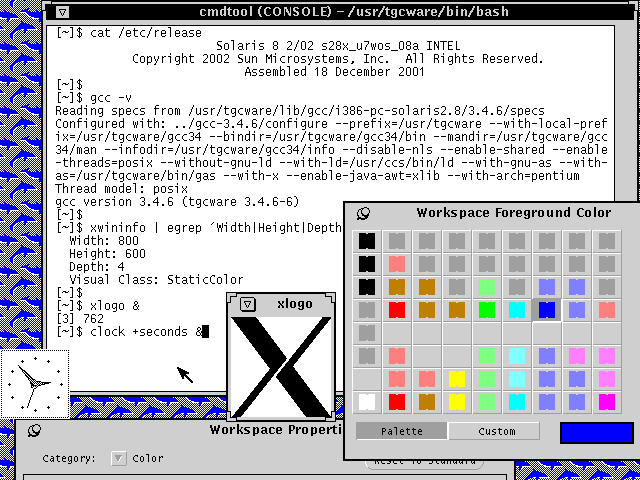 

Everything up to this point (and following these steps) will allow you to build a working
Solaris 8 x86 virtual machine.
Networking should be fine (manual steps are necessary to configure the network).
If you've selected <strong>SoundBlaster 16</strong> as the Audio Controller in VirtualBox,
you can listen to that nostalgic Sun cowbell sound
(<code>cat /usr/demo/SOUNDS/sounds/cowbell.au > /dev/audio</code>) once again.
But you'll be missing many tools that are taken for granted in a modern Linux system, for example:
* a C compiler (Solaris 8 did <strong>not</strong> even ship with the K&R C compiler),
* the ssh suite (the pseudo-devices <code>/dev/random</code> and <code>/dev/urandom</code> do not exist), and of course
* the lack of any of the <i>modern</i> tools, e.g. <strong>openssl</strong>, <strong>openssh</strong>,
and <strong>gnu</strong> tools are a notable examples.

### Solaris 8 x86 Recommended Patch Cluster(s) & 112439-02
Sadly http://sunsolve.sun.com [sic] no longer exists, and finding patches can be difficult.
While it's nicest to apply all of the recommended patches, the most important patch is <strong>112439-02</strong>
which provides the pseudo-devices <code>/dev/random</code> and <code>/dev/urandom</code>.

It's best if you're able to find the
[Solaris 8 x86 recommended patch cluster](http://ftp.lanet.lv/ftp/unix/sun-info/sun-patches/8_x86_Recommended.zip)
and install the cluster for best results.

Next, either find and install the patch
[112439-02](http://ftp.lanet.lv/ftp/unix/sun-info/sun-patches/112439-02.zip).
That patch is also included in the
[J2SE Solaris 8 x86 recommended patch cluster](http://ftp.lanet.lv/ftp/unix/sun-info/sun-patches/J2SE_Solaris_8_x86_Recommended.zip)
if you want to install that cluster in addition to the regular recommended patch cluster.

### Pre-compiled Solaris 8_x86 Binaries
This is really a deal breaker for a usable system if you're unable to find any prebuilt packages. 
Fortunately, [tgcware](http://jupiterrise.com/tgcware/)
is there to the [rescue](http://jupiterrise.com/tgcware/sunos5.8_x86/stable/)!
I can't stress enough what a tremendous help and time-saver this was.
There's a good selection of tools assembled (with various versions of some of the tools) and
each package that was prebuilt is listed with its name, brief description, and its <code>md5sum</code> checksum.
 
This guide includes a simple script for getting the prebuilt binaries from [tgcware](http://jupiterrise.com/tgcware/sunos5.8_x86/stable/).

# </a>Getting Started&nbsp;&nbsp;&nbsp;&nbsp;[:top:](#top00) 
This guide includes some package install scripts to help smooth the process
and perform some task that are minor enhancements or missing in the original.
It is recommended that you review each script and make any changes suited to
your particular environment or needs.  The scripts are named as <code>001-gzip.sh</code>, etc.,
so that <code>ls 0\*.sh</code> will list all of the scripts.

#### 1. Download the Solaris 8 x86 ISO Images
Use your browser or use <code>wget</code> to get the ISOs, e.g. 
* <code>wget -c https://archive.org/download/sol-8-u7-ia/sol-8-u7-ia-v1.iso</code>

#### 2. Download the Solaris 8 x86 Recommended Patch Cluster(s)
After you have downloaded the necessary
[cluster patch](http://ftp.lanet.lv/ftp/unix/sun-info/sun-patches/8_x86_Recommended.zip)
and [112439-02](http://ftp.lanet.lv/ftp/unix/sun-info/sun-patches/112439-02.zip),
make a copy of the files and uncompress all of the files.
It will make the process easier and the install scripts provided assume that the packages are uncompressed.

#### 3. Download the <code>tgcware</code> Prebuilt Packages
This guide provides a simple installation script for acquiring the pre-built packages
from [tgcware](http://jupiterrise.com/tgcware/sunos5.8_x86/stable/).
* Run the script <code>get_tgcware.sh -h</code> for usage instructions.

The packages selected are meant as a starting point to build the
Solaris 8 x86 VM with a basic/sane configuration, e.g.: 
<code>bash</code>, <code>vim</code>, <code>gcc</code>, and the <code>openssl</code>/<code>openssh</code>
suite are installed along with other basic tools. 
Please feel free to change anything to your specific requirements/tastes.

All of the packages from [tgcware](http://jupiterrise.com/tgcware/sunos5.8_x86/stable/) are <code>.gz</code> files
<i>except</i> for the [gzip](http://jupiterrise.com/tgcware/sunos5.8_x86/stable/gzip-1.6-1.tgc-sunos5.8-i386-tgcware) package
(for obvious reasons).
 Like with the patch files, copy and uncompress all of the pre-built software files.

#### 4. Review the <code>bashrc</code> and <code>vimrc</code> dot-file Templates and <code>0\*.sh</code> Scripts
I've include some of my simple shell and vim hacks to get things started.
 Put a copy of those files in the same location as all of the other files and
the <code>0\*.sh</code> scripts as well.

#### 5. Building the "tools" CD :cd:
I decided, after a few install iterations, the easiest thing to do was to 
create a CD ISO image containing all of the packages and scripts used to build the system.
I emphasize a CD volume because I'm not sure if Solaris 8 "knows" about DVD file systems;
if it can, then use whatever format you want (although most burners will select the
format automatically based on the size of the image to create). 
Note, <i>you don't actually need to burn a CD</i>, just use whatever software to create a CD image file
that can be mounted in VirtualBox.  I used <strong>K3b</strong>.
Solaris 8 will automatically detect when the ISO image is mounted through VirtualBox
(unless it's in single user/maintenance mode).

<!-- It's a shame that github strips the style tags,
     have to make due with a few SPACEs before the button -->

# VirtualBox Configuration&nbsp;&nbsp;&nbsp;&nbsp;[:top:](#top00)
It's easier to show all of the screenshots of the VirtualBox setting that were used
with notes as needed to clarify the process.
After building the new machine (setting its name, memory, and hard drive), use these
screenshots to perform the final setting that are needed.
Items that are not show are settings that don't affect the outcome
(e.g., whether the <strong>Shared Clipboard</strong> is enabled, etc.)

#### General
* 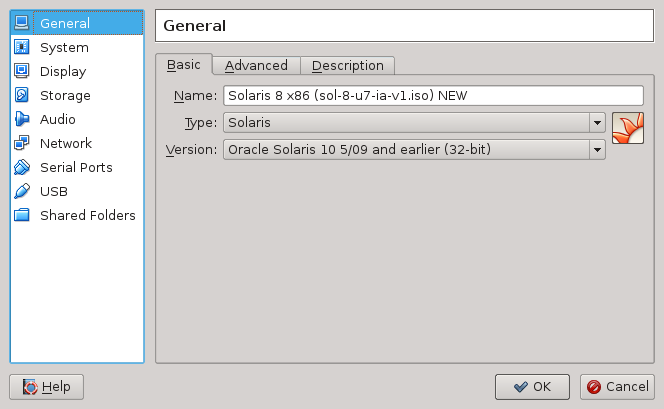 
Ensure the 32-bit version is selected.

#### System
* Notice that the floppy disk is unchecked from the <strong>Boot Order:</strong> list, and 
2 gigabytes is pretty generous for these old architectures... 
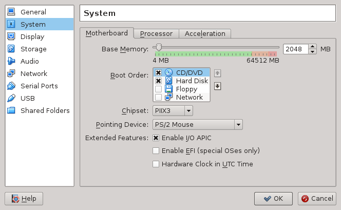 

* I configured a 2 CPU system.  I'm not sure how many CPUs Solaris 8 x86 supports. 
It's trivial to add CPUs to the system after it's built and see if they're
seen by the Solaris 8 
kernel after the system is rebooted. 
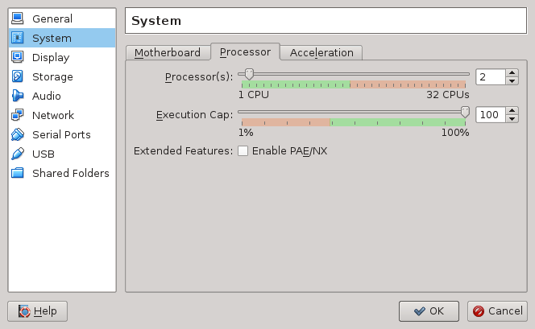 
Based on [What's New in Solaris 8 Operating Environment](http://www.ing.iac.es/~cfg/pub_notes/solaris/solaris%208%20whatsnew.pdf),
Solaris 8 x86 will support 32 Gbytes of 
memory using PAE if you want to go above a 4 gigabyte memory configuration.

* 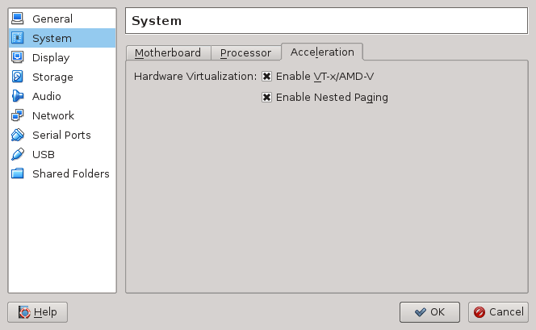 

#### Display
* I don't know if <strong>Enable 3D Acceleration</strong> actually helps (doesn't hurt, though). 
I believe Solaris 8 x86 ships with OpenGL 1.3, but I'm not sure how well
intregration is with VirtualBox. 
The video memory size is just a guess and should be okay. 
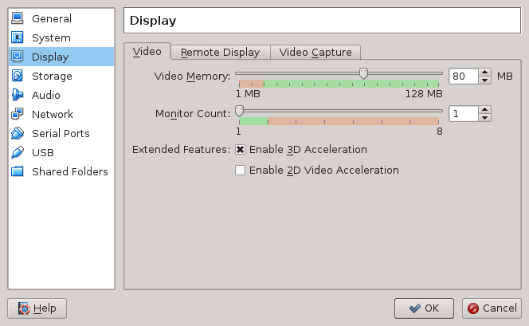 

#### Storage
* Install/mount the Solaris 8 media <strong>sol-8-u7-ia-v1.iso</strong>, this is the boot media. 
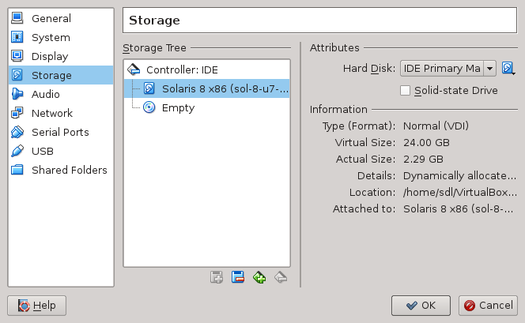 

#### Audio
* You can configure the VM to support audio.  I'm not 100% what this is as far as number of channels or bits. 
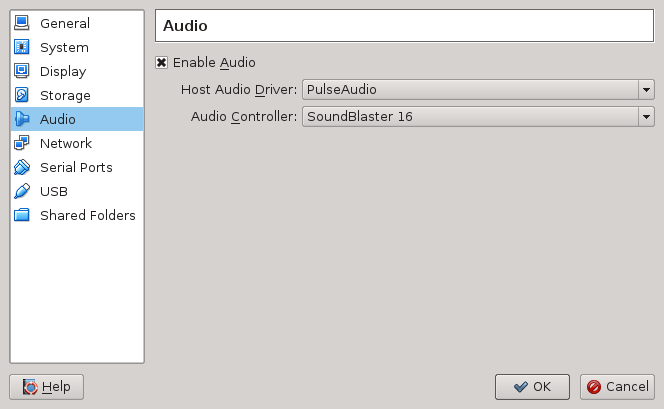 

#### Network
* Ensure that the adapter type is set <strong>PCnet-PCI II (Am79C970A)</strong> (others may work, I haven't tried). 
Multiple adaapters should work, but the network will require a different configuration (I believe) 
and this guide does not cover those steps. 
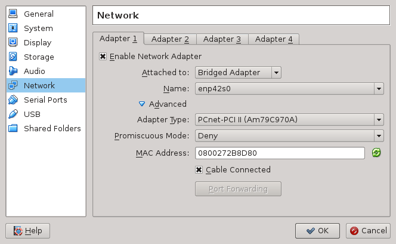 

#### Serial Ports
* No serial ports were configured.

#### USB
* Enabled -- USB is supported according to the documentation.

#### Shared Folders
* No folders are configured.

# Installing: First Boot&nbsp;&nbsp;&nbsp;&nbsp;[:top:](#top00)

<strong>It's suggested that you read through these steps before booting the VM for the first time.</strong> 
This is where a few non-obvious steps are taken to ensure a good build.
* Start the virtual machine.
You should see a brief booting screen followed by the following screen -- 
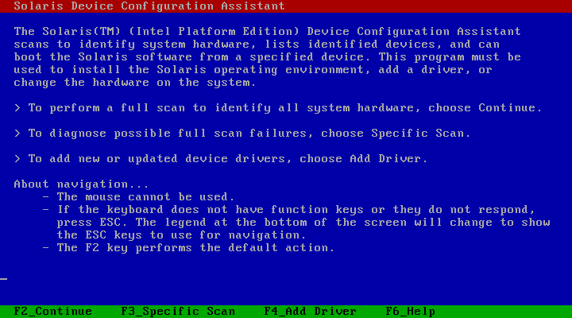 
Press 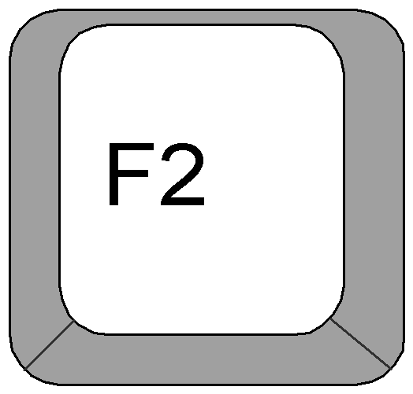
to continue the booting process. 
The <strong>Scanning Devices</strong> screen with a text-based progress bar will be displayed. 
&nbsp;&nbsp;&nbsp;&nbsp;&nbsp;&nbsp;&nbsp;&nbsp;&nbsp;&nbsp;&nbsp;&nbsp;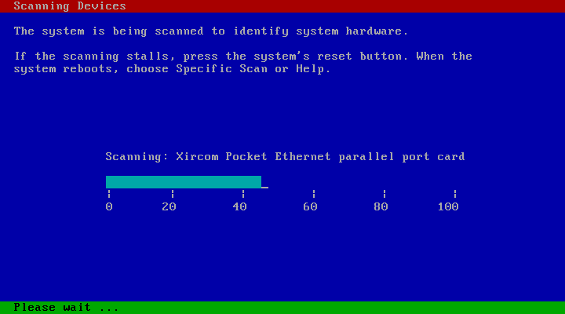 

:exclamation::exclamation: <strong>Review the Identified Devices screen.</strong> 
* 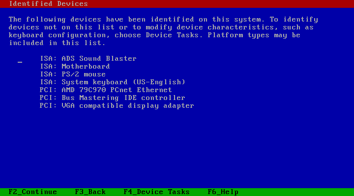 
Ensure that it looks as close to this as possible and that none of the expected devices are missing or 
"generically" identified (notice the missing <strong>ADS Sound Blaster</strong> and <strong>PCI: Ethernet controller</strong> entry). :arrow_lower_left: 
&nbsp;&nbsp;&nbsp;&nbsp;&nbsp;&nbsp;&nbsp;&nbsp;&nbsp;&nbsp;&nbsp;&nbsp; 
If the Identified Devices screen looks like the above, then the most likely cause is that there's an incorrect setting in the VM. 
Power off the VM and review the above settings screens [:up:](#virtualbox-configuration).
Then boot the VM again and ensure it's correct. 

* If everything looks okay, then press 
to the next steps of the booting process. 
&nbsp;&nbsp;&nbsp;&nbsp;&nbsp;&nbsp;&nbsp;&nbsp;&nbsp;&nbsp;&nbsp;&nbsp;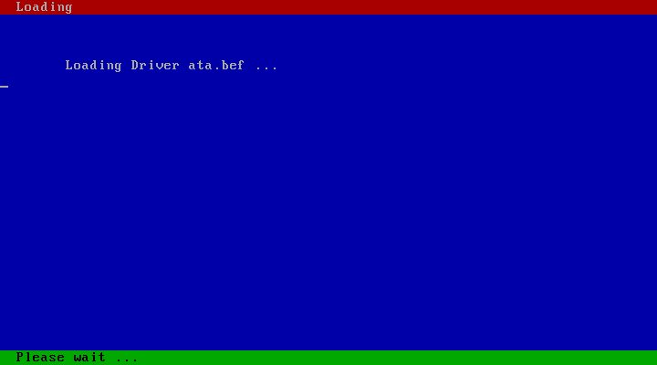 

* After the driver is loaded the <strong>Boot Solaris</strong> screen appears. 
Navigate using the arrow keys, then press SPACE to selct the CD device to boot Solaris 8. 
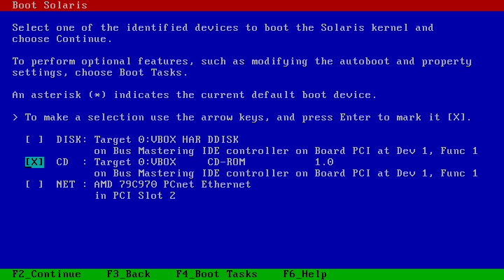 
Press  to boot Solaris 8 and start the installation.

* After the driver is loaded the <strong>Boot Solaris</strong> screen appears. 
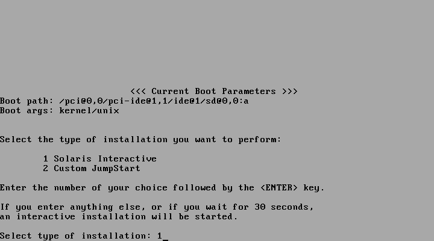 
 Select <strong>1. Solaris Interactive</strong> and press <strong>ENTER</strong> to boot the kernel. 
&nbsp;&nbsp;&nbsp;&nbsp;&nbsp;&nbsp;&nbsp;&nbsp;&nbsp;&nbsp;&nbsp;&nbsp;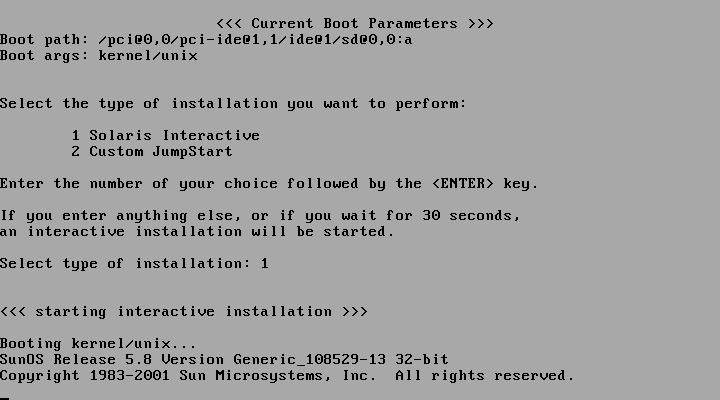 

* Perform the installation - select the language, etc. (only the interesting screens will be shown). 
  
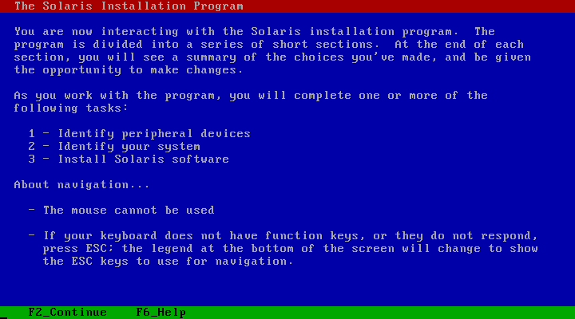 
Press  to continue the installation. 

* You'll need to tell the installer about the video device. 
A lot of steps are necessary to get a usable video configuration. 
 
Press  to continue the installation.  
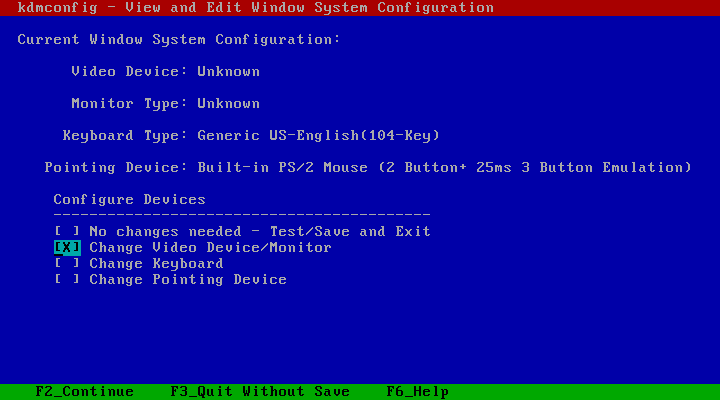 
Press  to continue the installation. 

# Window System Configuraton&nbsp;&nbsp;&nbsp;&nbsp;[:top:](#top00)
#### :camera: It's recommended that you take a snapshot of the VM here... 
* <strong>Video Device Selection</strong>
There are *a lot* of video devices listed, unfortunately only the first two are available. 
I selected the second option just to get a little more useable screen (even with the panning). 
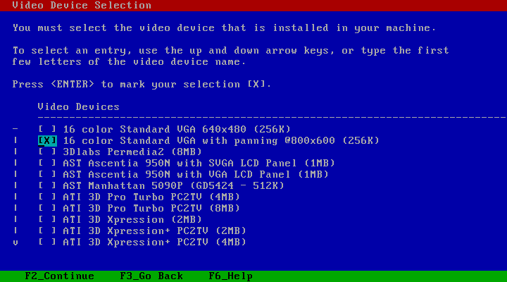 
Press  to continue. 

* <strong>Monitor Type Selection</strong> 
I _think_ any *MultiFrequency* monitor will work, just pick the first. 
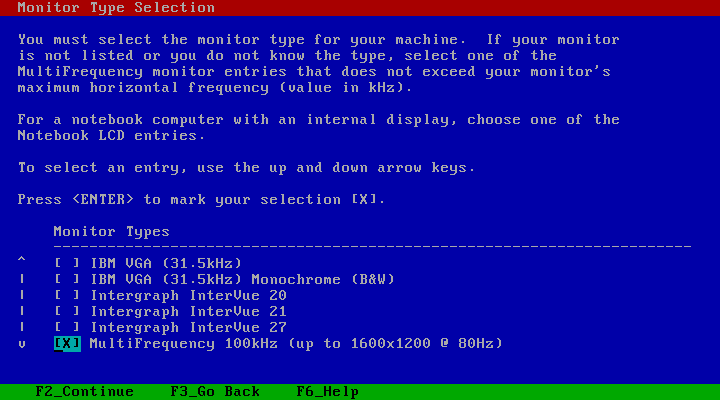 
Press  to continue. 

* <strong>Screen Size Selection</strong> 
Any size should work, I selected a 17-inch. 
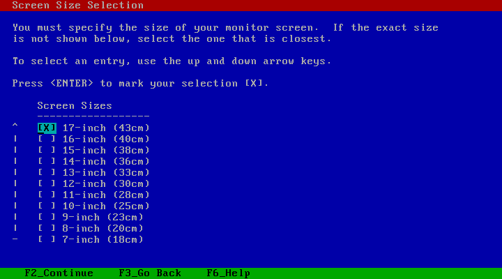 
Press  to continue. 

* <strong>Virtual Screen Resolution Selection</strong> 
Because panning was selected, select the panning size. 
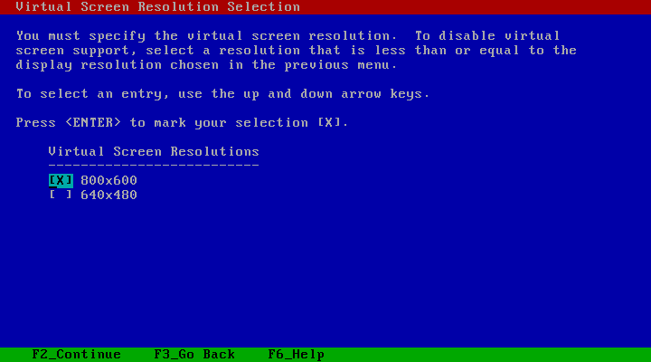 
Press  to continue. 

* <strong><code>kdmconfig</code>:: View and Edit Window System Configuration</strong> 
The installer will allow you to continue. 
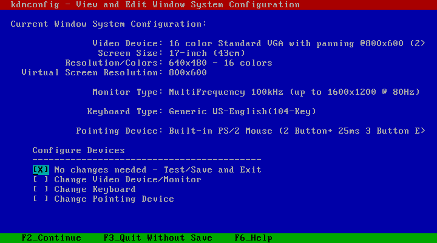 
Press  to continue. 

* <strong><code>kdmconfig</code>:: Window System Configuration Test</strong> 
Make sure everything works. 
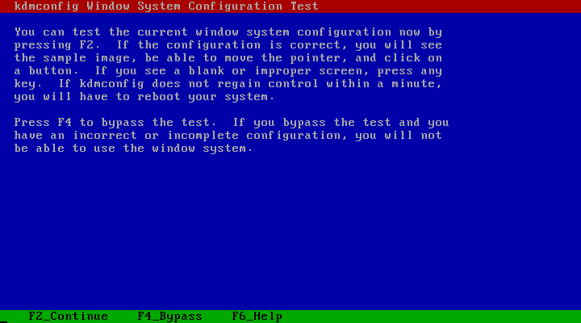 
Press  to perform the display test.  
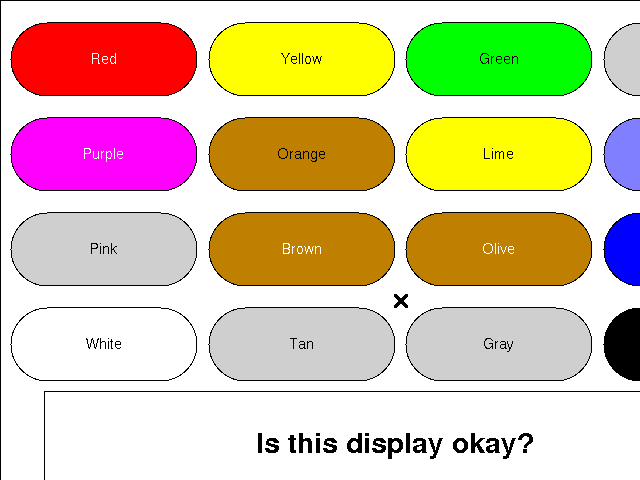 
* If you see the above image, then the Window System Configuration was successful. 
Note, not all of the colors _work_ (agree with their label), but this is how it looks. 
If the display doesn't work, appears to hang, or is incorrect you can wait about 20 seconds
and the screen will revert to the [View and Edit Window System Configuration](#view-and-edit) screen. 
If everything looks fine, click in the VM's window and scroll to the big rounded <strong>Yes</strong> button
to start the <strong>Solaris Install Console</strong>.

# Solaris Install Console&nbsp;&nbsp;&nbsp;&nbsp;[:top:](#top00)

#### :camera: It's recommended that you take a snapshot of the VM here... 
* The installation from this point requires the use of the mouse and follow the images.
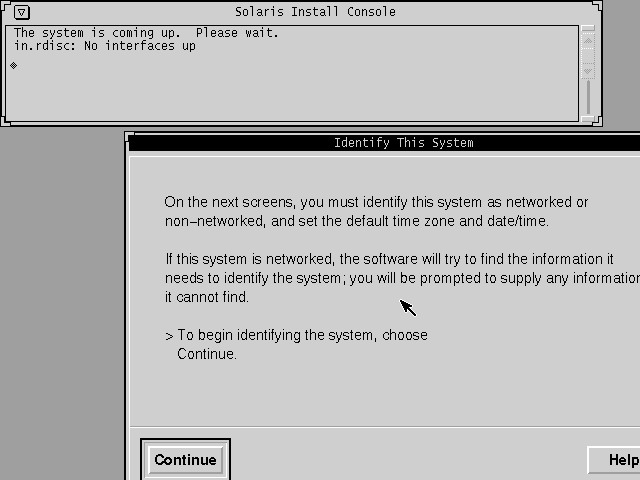 
Click <strong>Continue</strong>. 
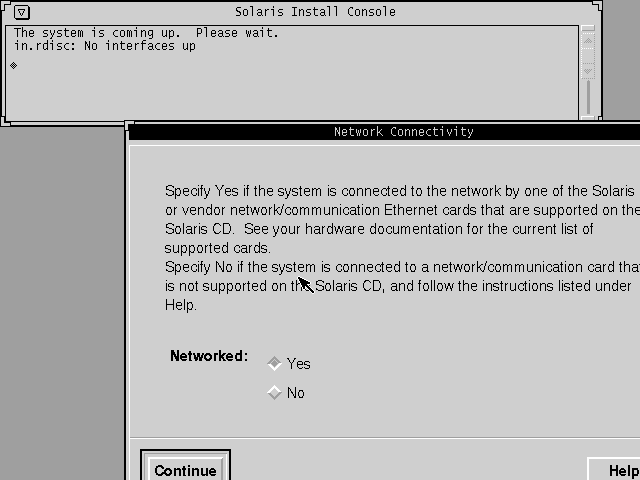 
Click <strong>Continue</strong>. 
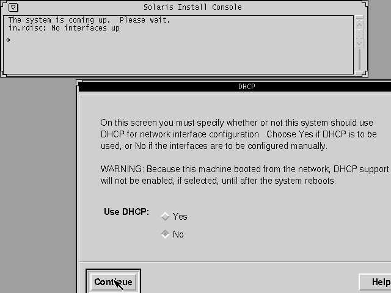 
Click <strong>Continue</strong>. 
* Enter the VM's hostname. 
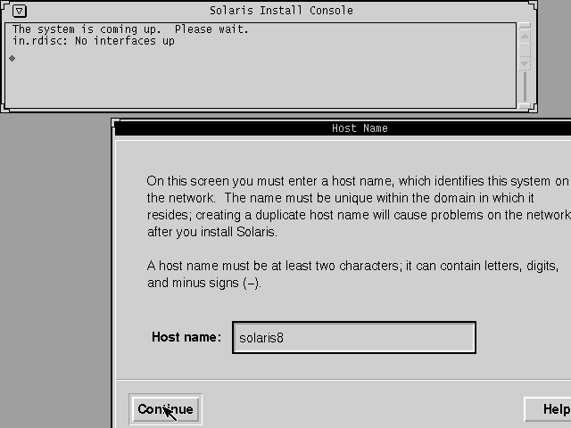 
Click <strong>Continue</strong>. 
* Enter the VM's IP address for the network device. 
Note that the address must agree with the network configuration
that the <strong>bridged adapter</strong> is connected to on the host. 
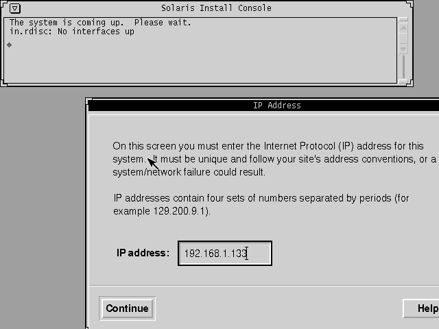 
Click <strong>Continue</strong>. 
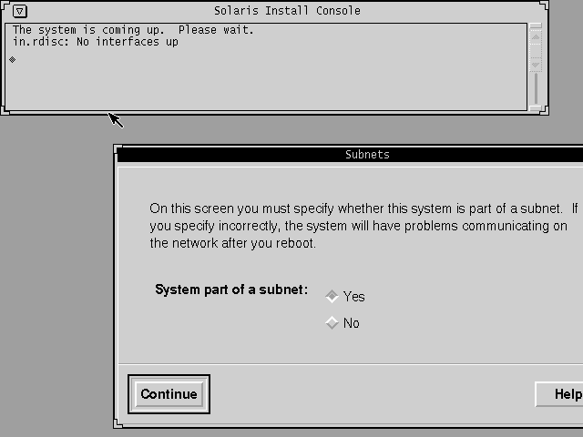 
Click <strong>Continue</strong>. 
* Enter the appropriate <strong>Netmask</strong>. 
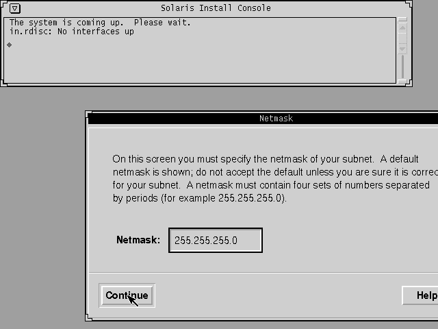 
Click <strong>Continue</strong>. 
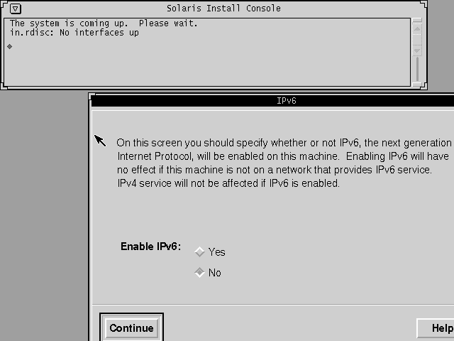 
Click <strong>Continue</strong>. 

### Confirm the Network Settings&nbsp;&nbsp;&nbsp;&nbsp;[:top:](#top00)
* Confirm the setting and click <strong>Continue</strong>. 
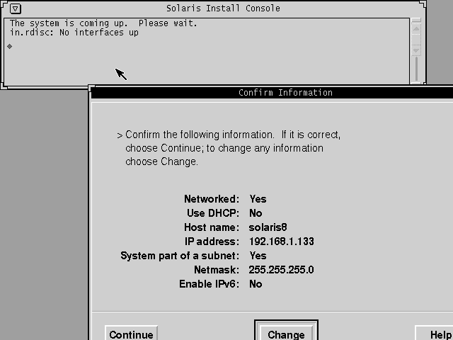  
Kerberos Security Settings (not used) 
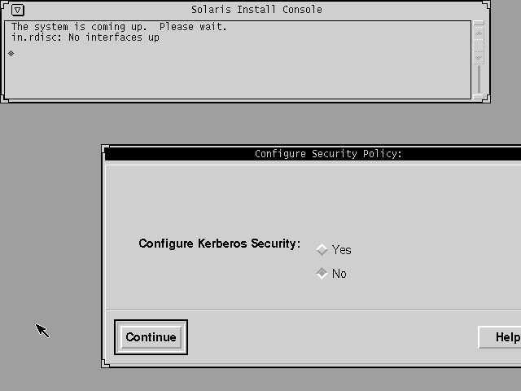 
Click <strong>Continue</strong>. 
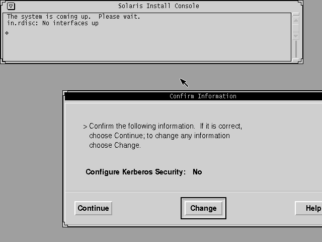 
Click <strong>Continue</strong>. 

### Select Name Service&nbsp;&nbsp;&nbsp;&nbsp;[:top:](#top00)
* Select <strong>None</strong> and press <strong>RETURN</strong>. 
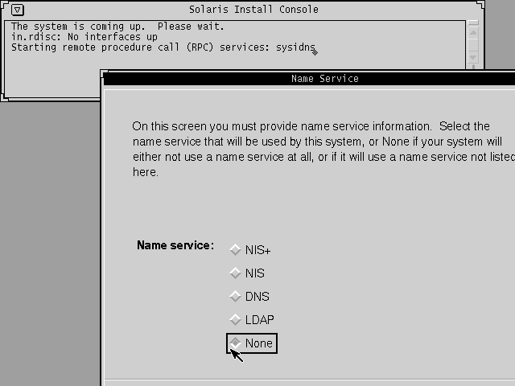  
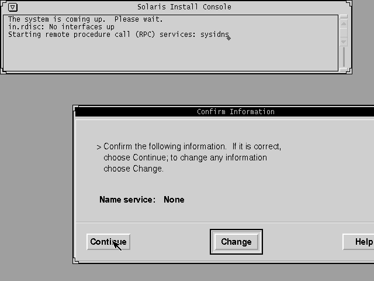 
Click <strong>Continue</strong>. 

### Select the Time Zone&nbsp;&nbsp;&nbsp;&nbsp;[:top:](#top00)
* Nothing special in this section, just follow the prompts and set to your preferences...

## Solaris Interactive Install&nbsp;&nbsp;&nbsp;&nbsp;[:top:](#top00)
* Click <strong>Continue</strong>. 
  

* <strong>Select Geographic Regions</strong> 
I selected everything, but choose to suit you tastes...
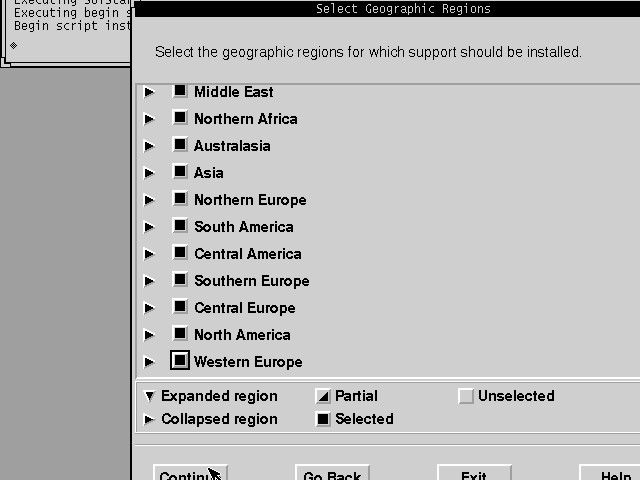 
Click <strong>Continue</strong>. 

* <strong>Select Software</strong> 
Select <strong>Entire Distribution plus OEM support</strong>;
it's ensures you'll have everything needed for the system.
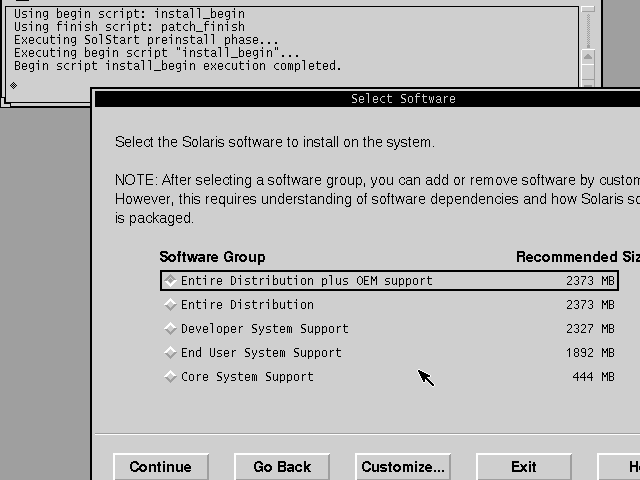 
Click <strong>Continue</strong>. 

* <strong>Select Disks</strong> 
The installer should have pre-selected <strong>c0d0</strong>, 
Click <strong>Continue</strong>. 
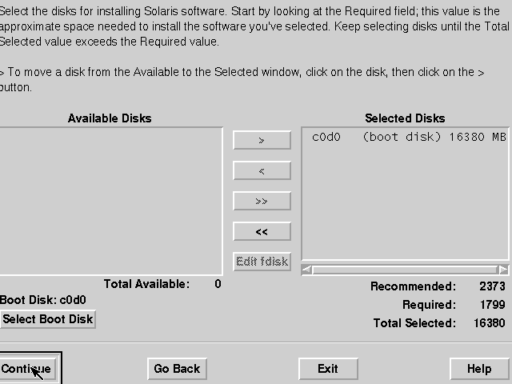 
* Click <strong>Auto Layout</strong>. 
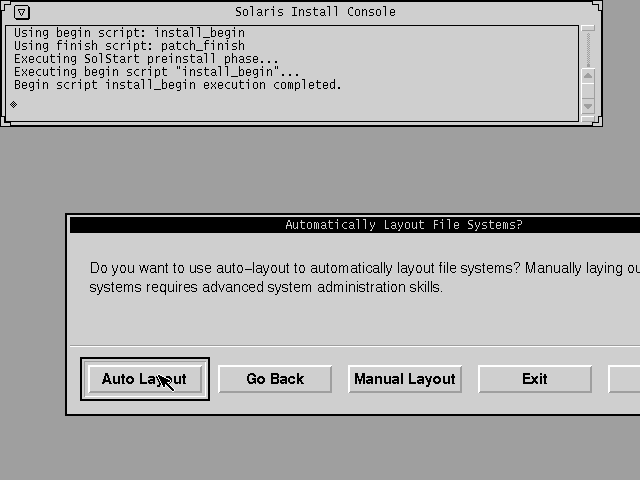 
* You can split up the OS filesystem layout here if you want, but this is the simplest approach. 
Click <strong>Continue</strong>. 
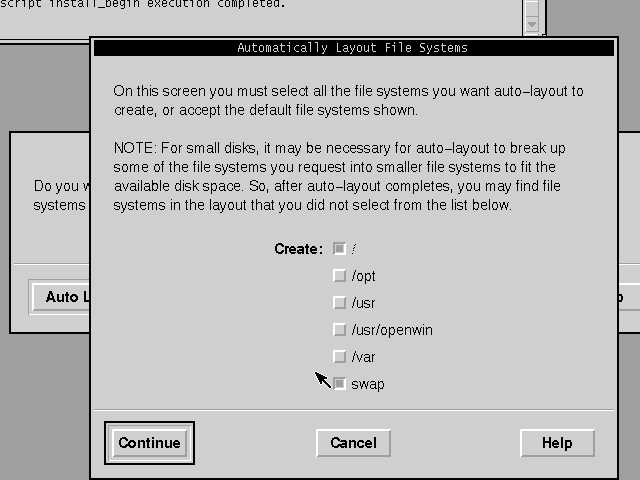 

#### Customize the File System&nbsp;&nbsp;&nbsp;&nbsp;[:top:](#top00)
* The default provided by the installer is too small and won't accomidate the prebuilt software, etc. 
Click <strong>Customize</strong>.  
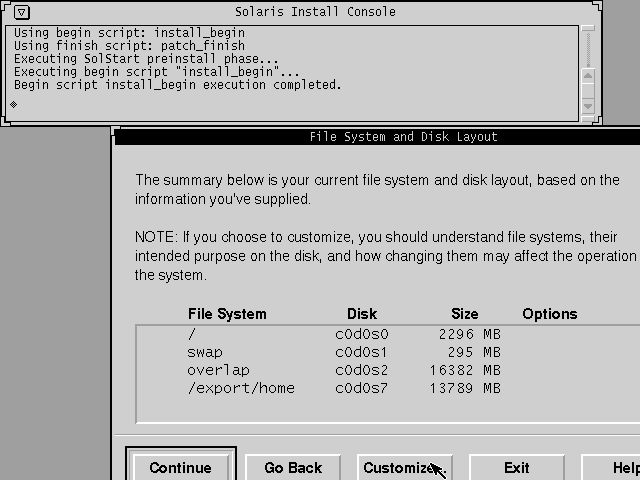 

* <strong>Solaris FS history, FYI</strong> 
For long forgotten reasons (at least I don't remember :innocent:), every vendor had their own particular 
way of dealing with file systems on hard drives.  Sun microsystems was no different.  A Sun hard drive 
is split into 8 partitions and each partition is generally "hard-wired" with a specific use.  As a good 
rule of thumb, you should <strong>not</strong> change their meanings.  In simplist terms: 
  * the root <code>/</code> filesystem should be installed on partition 0;
  * the <code>swap</code> filesystem was partition 1; and
  * partition 2 always mapped to the whole drive (<i>don't change this value</i>). 
  This is generally used when the whole drive is a single partition.

  These should not be changed unless you have a very specific need to do so.
  Partitions 3 through 7 
  were freely configurable, and usually partition 7 contained
  the <code>/export/home</code> filesystem.
* Start by shrinking the <code>/export/home</code> filesystem to <strong>100 MB</strong>. 
This will stop the installer from complaining when you increase the size of other partitions. 
Generally, this guide requires about 1.5GB in the root filesystem, but if you want to add 
additional packages and tools, you'll need to size it accordingly. 
Below are the setting that were used for this VM. 
When you are satisfied, pan down and press <strong>OK</strong>, and then press <strong>Continue</strong>. 
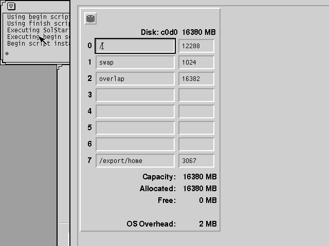 

* <strong>Mount Remote File Systems?</strong> 
Nothing to do here, so press <strong>Continue</strong>.

#### :camera: It's recommended that you take a snaphot of the VM here... 
* <strong>Review the Configuration</strong> 
Review your configuration and press <strong>Begin Installation</strong> to install Solaris 8 x86.
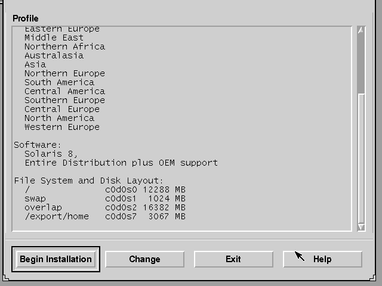 

#### Select <strong>Auto Reboot</strong> and the Installation Will Begin... 
&nbsp;&nbsp;&nbsp;&nbsp;&nbsp;&nbsp;&nbsp;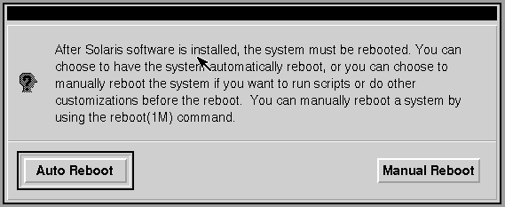 
&nbsp;&nbsp;&nbsp;&nbsp;&nbsp;&nbsp;&nbsp;...right after you click the <strong>OK</strong> in one more information box after the above dialogue :wink:. 

#### Some Installation Caps:
* The installation to the first reboot takes about ½ hour or so.  Your mileage may vary... 
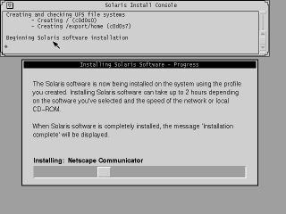&nbsp;
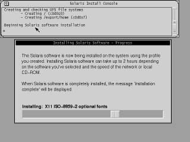 

# Installing: Reboot&nbsp;&nbsp;&nbsp;&nbsp;[:top:](#top00)
* <strong>Solaris Device Configuration Assistant</strong> 
After the first part of the installaton has finished, the system is rebooted to the 
Solaris Device Configuration Assistant. 
 
Press 
to continue with the device identification. 

### Enable DMA&nbsp;&nbsp;&nbsp;&nbsp;[:top:](#top00)
* Solaris disables DMA and this makes disk access noticably slower in the VM. 
Enable DMA using the following steps (starting from the <strong>Identified Devices</strong> screen): 
 
Press  to load the <code>ata.bef</code> driver.

* <strong>Boot Solaris</strong> 
At the Boot Solaris screen, press <strong>F4</strong> to enter the <strong>Boot Tasks</strong> screen. 
Select <strong>View/Edit Property Settings</strong> and press . 
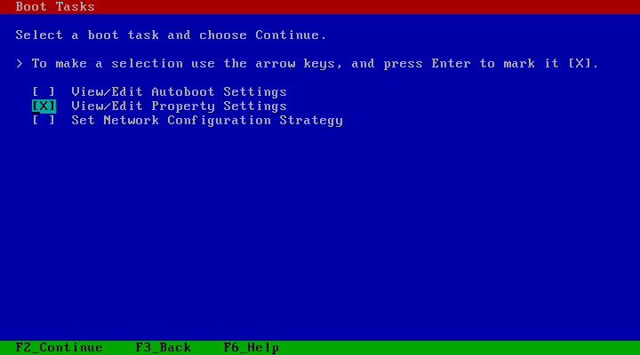 
* <strong>Select the <code>ata-dma-enabled</code> Entry</strong> 
Navigate to the ata-dma-enabled entry,
press <strong>SPACE</strong> (or 'X') then press <strong>F3</strong> to edit its value to "1". 
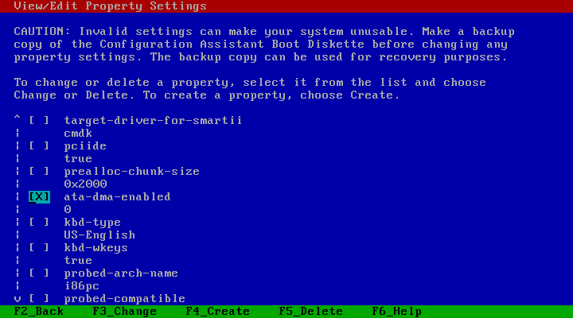 
After entering "1", press  <strong>twice</strong>, then press <strong>F3</strong> to return to the <strong>Boot Solaris</strong> screen. 

* <strong>Boot Solaris</strong> (2nd time) 
Now we're ready to boot from the hard drive. 
Select the <strong>DISK:</strong> device and press  to boot from the newly installed Solaris 8 VM.
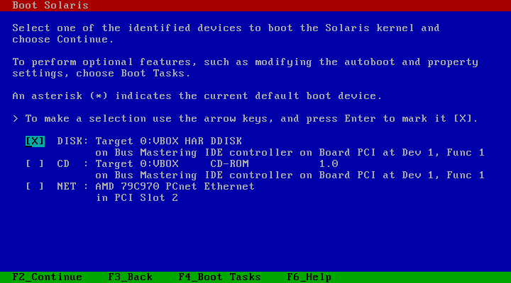 

* <strong>Launcher Issue Fix</strong> 
On systems with a limited display (like the VM in VirtualBox), there's an annoying Launcher bug where 
the GUI will fail and leave the system in a reboot only state.
We'll fix that in <strong>maintenance mode</strong> in order 
to get past this step and finish the installation.
  * At the <code>&lt;&lt;&lt; Current Boot Parameters &gt;&gt;&gt;</code> screen and at the
<code>Select (b)oot or (i)nterperter:</code> 
prompt, enter <strong>b -s</strong> and press <strong>RETURN</strong> to boot into maintenance mode. 
  * There's no root password set yet, so just press <strong>RETURN</strong> to get to a shell prompt. 
  * Enter <code>vi /etc/init.d/webstart</code> and look for the line <strong><code>CUI=</code></strong>. 
    Change the line to read <code>CUI=</code><strong>yes</strong>.  Save the file and quit the editor. 
  * Enter <code>exit</code> to leave the shell to continue the boot into multi-user mode. 

* <strong>Root password</strong> 
After the VM boots
(after the <i>RPC timed out</i> message to appear), enter the Root password and confirm.

* <strong>Mount the Second CD</strong> 
Since the installation is not complete, the installer will ask where the media is for the 2nd CD.  Enter <code>1</code> 
and press <strong>ENTER</strong>.  The installer will <i>always</i> eject the current media
and prompt you to insert the CD/DVD 
for <strong>Solaris 8 Software 2 of 2 (2/02 Intel Platform Edition)</strong>. 
Use the VM's VirtualBox Setting to eject the current CD media and mount the <strong>sol-8-u7-ia-v2.iso</strong> media. 
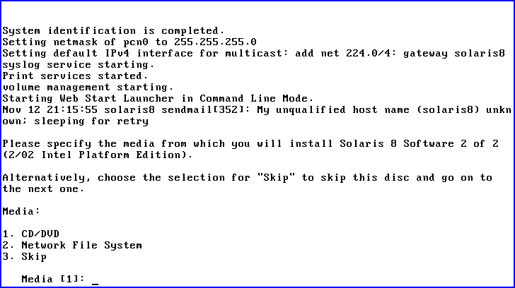 
The message "Reading Solaris 8 Software 2 of 2 (2/02 Intel Platform Edition)..." will be displayed. 

* </strong>Finish the installation following the prompts.</strong>
No special steps are necessary, pretty straightforward.

### </strong>Reboot after the installation is complete.</strong>
Press <strong>RETURN</strong> to reboot!

    

okay

#### :camera: It's recommended that you take a snaphot of the VM here... 

