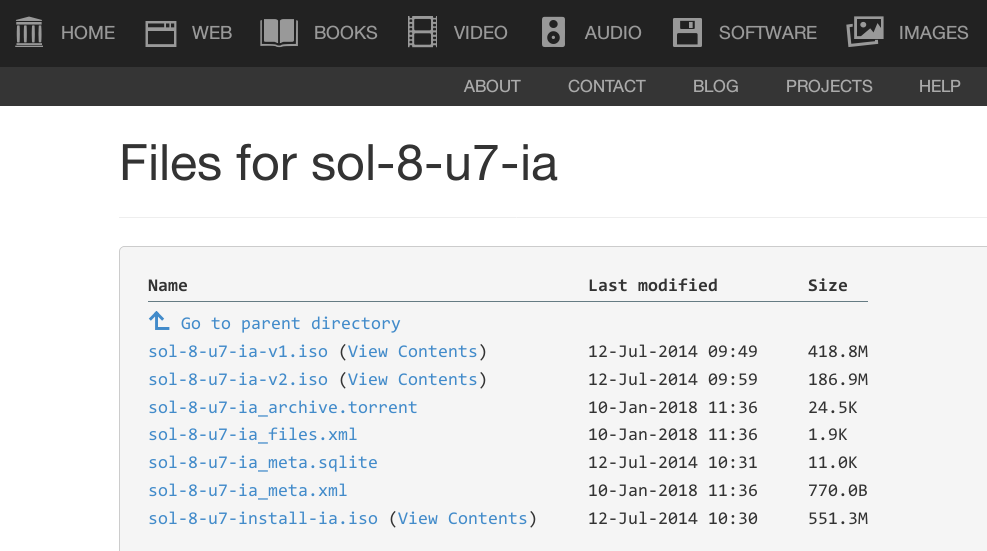

# Steps For Installing Solaris 8 x86 on VirtualBox

This (hobby) project list the steps that I've used to build a Solaris 8 x86 virtual machine in VirtualBox.
These steps were built from a number of sources that I used to guide me through the process.

I've spent many years working in the Sun architecture, from the
[SPARCstation 1](https://en.wikipedia.org/wiki/SPARCstation_1)
through the [Sun Ultras](https://en.wikipedia.org/wiki/Sun_Ultra_series)
they were my first real taste of Unix and 32-bit computing.

Once in a while, I need to do something in this olde OS, and
using a virtual machine makes it easy.
But, building the virtual machine had its challenges from:
* finding installable ISO images,
* finding recommended patches, and
* "fixing" things that seemed to have been broken in the original OS and the patches.

The process took longer than I expected
but after getting things to actually work was pretty satisfying and fun.
There will probably be errors and omissions, but I hope these steps will be useful.

:boom: There are likely <i>many</i> bugs, errors, incomplete and missing features and documentation.
<!--
[//]: # (https://alvinalexander.com/technology/markdown-comments-syntax-not-in-generated-output)
[//]: # (https://stackoverflow.com/questions/4823468/comments-in-markdown)
[//]: # (https://www.javaworld.com/article/2073149/software-disclaimer.html)
-->
### Disclaimer
:exclamation: 
<strong>This SOFTWARE PRODUCT is provided by THE PROVIDER "as is" and "with all faults."</strong> 
THE PROVIDER makes no representations or warranties of any kind concerning the safety, suitability,
lack of viruses, inaccuracies, typographical errors, or other harmful components of this SOFTWARE PRODUCT.
There are inherent risks and dangers in the use of any software, and you are solely responsible for determining
whether this SOFTWARE PRODUCT is compatible with your equipment and other software installed on your equipment.
You are also solely responsible for the protection of your equipment and the backup of your data,
and THE PROVIDER will not be liable for any damages you may suffer in connection with using,
modifying, or distributing this SOFTWARE PRODUCT.

# System Requirements

### First, the host versions of the software used:

* The VirtualBox version is <code>4.3.32-1</code> (rpmfusion-free on <code>Fedora 21 x86_64, 4.1.13-100.fc21.x86_64</code>).
 I've had later versions of VirtualBox crash and burn with some VMs I've built in the past.
It's a problem because as far as I know, it's not possible to <strong>easily</strong> have multiple versions of VirtualBox
installed on the same machine (like you can do with the gcc compiler collection, e.g.).
There might be a way, but I haven't tried it and my version runs all of my VMs fine
(although the creature comforts added in later versions are nice, but the VMs
don't work).
* The Solaris 8 x86 version is available on [archive.org](https://archive.org/download/sol-8-u7-ia). 
 
You should download all of the Solaris 8 x86 ISO images: 
| Filename         | Image md5sum | Notes      |
| :----            | :----:       | ----       |
| <code>sol-8-u7-ia-v1.iso</code>      | <code>c243aa080e4c503f60cca48a8fd54e47</code> | Boot with this image |
| <code>sol-8-u7-ia-v2.iso</code>      | <code>6c63bcbbf9e92ed946f1435f6bb89e5f</code> | 2nd install image |
| <code>sol-8-u7-lang-ia.iso</code>    | <code>6164e7e2d24f2291689f2b1f82fccc0b</code> | Optional languages image |
| <code>sol-8-u7-install-ia.iso</code> | <code>91029b86d9eb130a73d83e7a67a817df</code> | This ISO image is not used in these steps. |

testing ...

